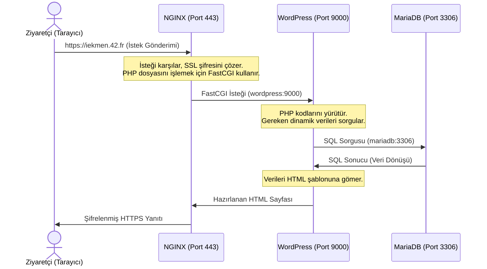

# Inception Projesi Geliştirici Dokümantasyonu (DEV_DOC.md)

Bu dokümantasyon, **Inception** projesinin sistem mimarisini, Docker yapılandırmalarını, ağ tasarımını, kalıcı depolama çözümlerini ve her bir servisin (NGINX, WordPress, MariaDB) iç detaylarını geliştirici perspektifinden açıklamaktadır.

---

## 1. Temel Konteyner Teknolojileri

### Docker Nedir?
Docker; yazılım uygulamalarını ve onların çalışması için gereken tüm kütüphane, bağımlılık ve ayarları **konteyner (container)** adı verilen standart ve izole edilmiş paketler içine koyarak çalıştıran açık kaynaklı bir platformdur.

Uluslararası ticarette kullanılan gemi konteynerleri gibi düşünülebilir: İçindeki yükün ne olduğundan bağımsız olarak, konteynerin boyutu ve şekli standarttır; her gemiye, trene veya tıra sorunsuzca yüklenebilir. Docker da yazılımınız için bu standart yalıtımı ve taşınabilirliği sağlar.

### Sanal Makine (VM) vs. Konteyner (Docker)
- **Sanal Makineler (VM):** Donanımı sanallaştırır. Sunucudaki her uygulamanın altına koca bir "Misafir İşletim Sistemi" (Guest OS - örn. tam bir Ubuntu veya Windows) kurmanız gerekir. Bu yapı GB'larca RAM, CPU ve disk alanı tüketir. Başlatılması dakikalar sürer.
- **Docker (Konteyner):** İşletim sistemini sanallaştırır. Konteynerler, altlarındaki ana makinenin (Host OS) işletim sistemi çekirdeğini (Kernel) ortaklaşa kullanır. İçlerinde sadece uygulamanın çalışması için gereken kodlar ve kütüphaneler bulunur. Bu sayede megabaytlar seviyesinde küçüktürler ve saniyeler (hatta milisaniyeler) içinde başlarlar.

### Temel Kavramlar
- **Dockerfile:** Uygulamanızın nasıl bir işletim sistemi ortamına ve bağımlılıklara ihtiyacı olduğunu yazdığınız yapılandırma dosyasıdır. (Örn: "Debian tabanını al, PHP kur, şu kodları kopyala ve 9000 portunu aç"). *Benzetme: Yemek tarifi kitabı.*
- **Docker Image:** Dockerfile'daki talimatların derlenmiş, dondurulmuş ve paketlenmiş halidir. Sadece okunabilir (read-only) formattadır. *Benzetme: Yemek tarifinin pişirilip dondurulmuş hali.*
- **Docker Container:** Bir Image'ın hafızaya alınıp çalıştırılmış halidir. Aynı Image kullanılarak yüzlerce bağımsız Container ayağa kaldırılabilir. *Benzetme: Dondurulmuş yemeğin mikrodalgada ısıtılıp masaya konmuş hali.*
- **Docker Engine:** Arka planda çalışan; konteynerleri oluşturan, başlatan, durduran ve yöneten asıl arka plan hizmetidir (daemon). *Benzetme: Aşçı.*
- **Docker Registry:** Image'ların depolandığı ve paylaşıldığı yerdir. En bilineni Docker Hub'dır. *Benzetme: Süpermarket.*

### İzolasyon ve Kaynak Yönetimi
Docker, Linux çekirdeğinin (Kernel) iki temel özelliğini kullanarak konteyner güvenliğini ve izole edilmesini sağlar:
- **Namespaces (İzolasyon):** Bir konteynerin, ana makinedeki diğer işlemlerden tamamen habersiz ve yalıtılmış olmasını sağlar. Konteyner kendi ağ arabirimini (network), kendi süreç ağacını (PID), kullanıcı tanımlarını (UID) ve disk alanını (mount) tek başına yönetiyormuş gibi hisseder.
- **Cgroups (Control Groups - Kaynak Yönetimi):** Hangi konteynerin donanımın ne kadarını (yüzde kaç CPU, kaç MB RAM) kullanabileceğini sınırlar. Böylece bir konteynerde oluşan bir bellek sızıntısı (memory leak) tüm sunucuyu kilitleyemez.

---

## 2. Docker Compose ve Mimari Tasarım

### Docker Compose Nedir?
Docker Compose, birden fazla Docker konteynerini tek bir yapılandırma dosyası üzerinden tanımlamanızı, birbirine bağlamanızı ve tek bir komutla topluca yönetmenizi sağlayan resmi bir araçtır. Sistem mimarisini bir metin belgesi olarak ("Infrastructure as Code") tanımlar.

### docker-compose.yml Dosyası
Projenin mimari planını oluşturan `srcs/docker-compose.yml` dosyasının içeriği ve parametre açıklamaları aşağıdadır:

```yaml
version: '3.8'

services:
  mariadb:
    build: ./requirements/mariadb
    image: mariadb
    container_name: mariadb
    restart: always
    env_file: .env
    volumes:
      - db_data:/var/lib/mysql
    networks:
      - inception_network

  wordpress:
    build: ./requirements/wordpress
    image: wordpress
    container_name: wordpress
    restart: always
    env_file: .env
    volumes:
      - wordpress_data:/var/www/wordpress
    networks:
      - inception_network
    depends_on:
      - mariadb

  nginx:
    build: ./requirements/nginx
    image: nginx
    container_name: nginx
    restart: always
    ports:
      - "443:443"
    volumes:
      - wordpress_data:/var/www/wordpress
    networks:
      - inception_network
    depends_on:
      - wordpress

volumes:
  wordpress_data:
    driver: local
    driver_opts:
      type: none
      o: bind
      device: /home/iekmen/data/wordpress
  db_data:
    driver: local
    driver_opts:
      type: none
      o: bind
      device: /home/iekmen/data/mariadb

networks:
  inception_network:
    driver: bridge
    name: inception_network
```

#### Genel Parametre Açıklamaları:
- **build:** Hazır bir Docker imajı kullanmak yasak olduğu için, Docker'a belirtilen dizindeki (örn: `./requirements/mariadb`) kendi yazdığımız `Dockerfile` dosyasını okumasını ve sistemi sıfırdan inşa etmesini söyler.
- **image:** Derlenen imaja verilecek ismi belirler.
- **container_name:** Çalışan konteynerin adını sabitler.
- **restart: always:** Olası bir hata veya sunucu kapanıp açılması durumunda konteynerin otomatik olarak yeniden başlatılmasını garanti eder.
- **env_file:** Veritabanı şifreleri ve admin bilgileri gibi hassas verileri `.env` dosyasından okuyarak çevre değişkeni olarak konteynere aktarır.
- **volumes:** Konteyner içindeki verilerin silinmesini önlemek için verileri ana makinedeki kalıcı disk alanına bağlar.
- **networks:** Konteyneri `inception_network` adlı özel izole iç ağımıza dahil eder.
- **ports (Sadece NGINX için):** Ana makinemize (host) `443` portundan (HTTPS) gelen tüm istekleri, NGINX konteynerinin `443` portuna yönlendirir. Proje kuralları gereği port `80` (HTTP) kapalı tutulmaktadır.
- **depends_on:** Servislerin başlama sırasını belirtir. WordPress, MariaDB ayağa kalkmadan; NGINX ise WordPress ayağa kalkmadan çalışmaya başlamaz.

---

## 3. Servislerin Teknik Detayları ve Yapılandırmaları

### A. MariaDB Servisi (Veritabanı)
MariaDB, WordPress web sitesinin hafızasını oluşturur. Sitenin adı, kullanıcı bilgileri, şifreler, yorumlar ve blog yazıları gibi dinamik veriler burada satır ve sütunlar halinde tutulur. Dış dünyaya tamamen kapalıdır; sadece WordPress'in erişebileceği güvenli bir kasadır.

#### 1. Dockerfile (`srcs/requirements/mariadb/Dockerfile`)
Docker bu dosyayı yukarıdan aşağıya doğru okur ve her satırda yeni bir katman (layer) oluşturarak nihai veritabanı imajını hazırlar.

```dockerfile
FROM debian:bullseye
```
- İmajın hangi temel işletim sistemi üzerine kurulacağını belirler.
- Docker Hub'dan Debian'ın "Bullseye" sürümünün tamamen boş, minimal bir versiyonunu indirir. Bundan sonraki tüm komutlar bu sanal Debian sisteminin içinde çalıştırılır.

```dockerfile
RUN apt-get update && apt-get install -y mariadb-server
```
- Paket listesini günceller ve MariaDB sunucu yazılımını kurar.
- `RUN` komutu, imaj inşaa edilirken (build aşamasında) çalışır.
- Önce `apt-get-update` ile Debian'ın paket depolarından güncel listeyi çeker.
- Sonra `apt-get install -y mariadb-server` ile veritabanını kurar.

```dockerfile
COPY conf/50-server.cnf /etc/mysql/mariadb.conf.d/50-server.cnf
COPY tools/mariadb_init.sh /usr/local/bin/
```
- Bilgisayardaki (host) dosyaları, konteynerin içindeki klasörlere kopyalar.
- `COPY [kaynak] [hedef]` mantığıyla çalışır.
- Normalde MariaDB kurulduğunda sadece `127.0.0.1` (localhost) üzerinden gelen bağlantıları kabul eder. Bu da WordPress'in ona bağlanmasını engeller. Hazırladığımız `50-server.cnf` dosyasını konteynerin içine kopyalayarak varsayılan ayarları eziyoruz (genellikle `bind-address = 0.0.0.0` yapmak için).
- İkinci satır ise veritabanını ilk kez ayarlayacak (kullanıcı ve şifre oluşturacak) olan bash betiğini (`mariadb_init.sh`), sistemin her yerden çalıştırabileceği `/usr/local/bin` dizinine kopyalar.

```dockerfile
RUN chmod +x /usr/local/bin/mariadb_init.sh
```
- Kopyanan bash betiğine "çalıştırabilme" (executable) yetkisi verir.

```dockerfile
EXPOSE 3306
```
- Konteynerin 3306 numaralı porttan dinleme yapacağını belgelendirir.
- 3306, MySQL ve MariaDB'nin standart portudur. `EXPOSE` komutu aslında bu portu dış dünyaya açmaz (onu `docker-compose` içinde ağ ayarları yapar). Sadece Docker'a ve bu dosyayı okuyan geliştiricilere "Bu servisle içeriden haberleşmek istersen 3306 portunu kullanmalısın" mesajını verir.

```dockerfile
ENTRYPOINT [ "mariadb_init.sh" ]
```
- Konteyner ayağa kalktığında (run edildiğinde) çalışacak olan ana programı (başlangıç noktasını) belirler.
- `ENTRYPOINT`, bir Docker konteynerinin kalbidir. Docker konteynerleri, içlerindeki ana süreç çalıştığı sürece hayatta kalırlar. Bu satır, konteyner başladığı an senin yazdığın `mariadb_init.sh` betiğini tetikler. Bu betiğin içinde veritabanı oluşturulur, şifreler `.env` dosyasından çekiliğ ayarlarnır ve betiğin en sonunda MariaDB arka plan hizmeti (`mysqld`) başlatılır.

#### 2. Yapılandırma Dosyası (`srcs/requirements/mariadb/conf/50-server.cnf`)
```ini
[mysqld]
bind-address = 0.0.0.0
port = 3306
user = mysql
```
* `bind-address = 0.0.0.0` ayarı, MariaDB'nin sadece `localhost` üzerinden değil, WordPress konteynerinden gelen iç ağ bağlantılarına da yanıt vermesini sağlar.

#### 3. Başlangıç Betiği (`srcs/requirements/mariadb/tools/mariadb_init.sh`)
```bash
#!/bin/bash
```
- İşletim sistemine (Debian), bu metin dosyasının içindeki komutları okurken `bash` programını kullanmasını söyler.

```bash
service mariadb start
sleep 5
```
- MariaDB'yi arka planda (daemon olarak) geçici bir süreliğine başlatır ve 5 saniye bekler.
- Veritabanı ve kullanıcı oluşturmak için SQL komutları (`CREATE DATABASE` vb.) göndermemiz gerekiyor. Ancak veritabanı motoru çalışmıyorsa bu komutları göndereceğimiz bir muhatap yoktur. Önce motoru çalıştırırız, `sleep 5` ile de sistemin tamamen ayağa kalkıp komut dinlemeye hazır hale gelmesi için ona zaman tanırız.

```bash
mysql -e "CREATE DATABASE IF NOT EXISTS \`${MYSQL_DATABASE}\`;"
```
- `mysql -e` : MariaDB'nin içine girip çıkmadan, terminal üzerinden doğrudan tek satırlık SQL komutu (-e / execute) göndermeyi sağlar.
- `.env` dosyasında belirlediğimiz isimde (örneğin `wordpress_db`) yepyeni ve boş bir veritabanı oluşturur. `IF NOT EXISTS`, konteyner bir şekilde yeniden başlarsa aynı veritabanını tekrar oluşturmaya çalışıp hata vermesini engeller.

```bash
mysql -e "CREATE USER IF NOT EXISTS \`${MYSQL_USER}\`@'localhost' IDENTIFIED BY '${MYSQL_PASSWORD}';"
mysql -e "GRANT ALL PRIVILEGES ON \`${MYSQL_DATABASE}\`.* TO \`${MYSQL_USER}\`@'%' IDENTIFIED BY '${MYSQL_PASSWORD}';"
```
- WordPress'in veritabanına bağlanırken kullanacağı özel kullanıcıyı (örn: `wp_user`) ve şifresini yaratır.
- Buradaki `@'%'` kısmı projenin çalışması için en kritik noktalardan biridir. `%` işareti "Herhangi bir IP adresi" demektir. WordPress farklı bir konteynerde (farklı bir IP'de) çalıştığı için, MariaDB'ye dışarıdan bağlanacaktır. Bu satır, WordPress kullanıcısına "uzaktan gelip bu veritabanı üzerinde her türlü işlemi (yazma, silme) yapma yetkisi" (`GRANT ALL PRIVILEGES`) verir.

```bash
mysql -e "ALTER USER 'root'@'localhost' IDENTIFIED BY '${MYSQL_ROOT_PASSWORD}';"
mysql -e "FLUSH PRIVILEGES;"
```
- Sistemin en yetkili kullanıcısı olan `root` şifresini güvenlik amacıyla senin `.env` dosyasında belirlediğin şifre ile değiştirir.
- `FLUSH PRIVILEGES` : MariaDB'ye "Az önce bir sürü yetki ve şifre değiştirdim, bunları hafızana al ve hemen şimdi uygulamaya başla" der.

```bash
mysqladmin -u root -p$MYSQL_ROOT_PASSWORD shutdown
```
- Başlangıçta açtığımız arka plan hizmetini, yeni belirlediğimiz root şifresini kullanarak kapatır.
- Neden kapatıyoruz? Çünkü Docker'ın altın bir kuralı vardır: Bir konteynerin içindeki ana süreç (PID 1) arka planda çalışıyorsa, Docker o işin bittiğini sanır ve konteyneri kapatır. Başlangıçtaki `servise mariadb start` komutu servisi arka planda başlatmıştı. Eğer böyle bırakırsan konteyner anında çöker.

```bash
exec mysqld_safe
```
- İşte konteyneri sonsuza kadar ayakta o sihirli satır budur.
- `mysqld_safe` : MariaDB'yi arka planda değil, doğrudan terminalin önüne kilitnemiş şekilde başlatır.
- `exec` : Linux'ta "Mevcut bash betiği sürecini öldür, onun yerine bu yeni programı koy" anlamına gelir. Böylece `mysqld_safe` işlemi sistemdeki 1 numaralı süreç (PID 1) haline gelir.

* **mariadb_init.sh Genel İşleyiş:** Konteyner ilk açıldığında arka planda geçici olarak MariaDB çalıştırılır. `.env` dosyasından gelen değişkenler ile gerekli veritabanı, kullanıcı ve yetkiler oluşturulur. Root şifresi güvenceye alınır. Ardından geçici servis durdurulup, konteynerin kapanmasını engellemek amacıyla `mysqld_safe` komutu `exec` ile PID 1 (ana süreç) olarak başlatılır.

---

### B. WordPress Servisi (Uygulama)
WordPress, PHP tabanlı içerik yönetim sistemidir. Dinamik sayfalar (PHP kodları) NGINX tarafından işlenemediği için NGINX bu istekleri FastCGI aracılığıyla WordPress'e iletir. WordPress de verileri MariaDB'den çekerek dinamik sayfaları oluşturup NGINX'e geri verir.

#### 1. Dockerfile (`srcs/requirements/wordpress/Dockerfile`)

```dockerfile
FROM debian::bullseye
```
- MariaDB'de olduğu gibi boş, minimal bir Debian 11 işletim sistemi indirir.

```dockerfile
RUN apt-get update && apt-get install -y \
    php7.4-fpm \
    php7.4-mysql \
    curl \
    mariadb-client
```
- Sistemin paket listesini günceller ve WordPress'in çalışması için gereken 4 temel programı kurar.
- `php7.4-fpm` : FPM (FastCGI Process Manager), PHP kodlarını web sunucularının (NGINX) anlayabileceği şekilde çok hızlı işleyen özel bir servistir. Standart `php` paketi yerine bunu kurmamız gerekiyor.
- `php7.4-mysql` : WordPress'in PHP kodlarının, az önce kurduğumuz MariaDB veritabanına bağlanıp konuşabilmesini sağlayan çevirmen eklentisidir.
- `curl` : İnternetten dosya indrime aracıdır.
- `mariadb-client` : Veritabanı motoru değildir, sadece terminalden veritabanına bağlanmayı sağlayan araçlardır. `wp-cli` aracaının veritabanı bağlantısını test edebilmesi için gereklidir.

```dockerfile
RUN curl -O https://raw.githubusercontent.com/wp-cli/builds/gh-pages/phar/wp-cli.phar && \
    chmod +x wp-cli.phar && \
    mv wp-cli.phar /usr/local/bin/wp
```
- `wp-cli` adlı aracı indirir, çalıştırılabilir yapar ve sistemin her yerinden `wp` komutuyla kullanılabilecek şekilde ayarlar.
- Normalde WordPress'i kurmak için tarayıcıdan girip "İleri, İleri, Şifre Belirle" gibi butonlara basman gerekir. Inception projesinde her şey otomatik olmalıdır. WP-CLI sayesinde hiçbir arayüze ihtiyaç duymadan, sadece terminal komutlarıyla WordPress indirebilir, veritabanına bağlayabilir ve admin hesabı açabilirsin.

```dockerfile
COPY conf/www.conf /etc/php/7.4/fpm/pool.d/www.conf
```
- Bizim dışarıda hazırladığımız özel ayar dosyasını, konteynerin içindeki varsayılan ayar dosyasının üzerine yazar.
- PHP-FPM  varsayılan olarak `.sock` (UNIX Socket) adı verilen yerel bir dosya üzerinden dinleme yapar. Bu, NGINX ve PHP aynı konteynerdeyse işe yarar. Ancak bizim projemizde NGINX başka bir konteynerde. Bu yüzden NGINX'in ona `inception_network` üzerinden ulaşabilmesi için `www.conf` içinde ayarı `listen = 9000` (TCP portu) olarak değiştirmemiz gerekir.

```dockerfile
COPY tools/wp_init.sh /usr/local/bin/
RUN chmod +x /usr/local/bin/wp_init.sh
```
- Konteyner ayağa kalktığında çalışacak olan ana bash betiğini kopyalar ve ona çalıştırılabilme (`+x`) yetkisi verir. MariaDB'deki mantığın aynısıdır. WordPress dosyalarını indirecek komutlar bu betiğin içindedir.

```dockerfile
RUN mkdir -p /run/php
```
- İşletim sisteminin içinde `/run/php` adında boş bir klasör oluşturur.
- PHP-FPM servisi başlatıldığında, kendi süreç kimliğini (PID) yazacağı bir klasör arar. Eğer bu klasör yoksa "PID dosyası oluşturulamadı" hatası verip sessizce çöker.

```dockerfile
EXPOSE 9000
```
- Bu konteynerin NGINX'ten gelecek PHP işleme taleplerini 9000 numaralı porttan dinleyeceğini belgelendirir.

```dockerfile
WORKDIR /var/www/wordpress
```
- Terminalde `cd /var/www/wordpress` komutu yazılmış gibi, konteynerin içindeki varsayılan konumu bu klasör yapar.
- Bu sayede `wp_init.sh` betiği çalıştığında veya sen ileride `docker exec` ile konteynere girdiğinde, doğrudan WordPress dosyalarının olduğu klasörün içinde başlarsın. Komutlarında sürekli uzun uzun `/var/www/wordpress` yolunu yazmak zorunda kalmazsın.

```dockerfile
ENTRYPOINT [ "wp_init.sh" ]
```
- Konteyner ayağa kalktığı anda kontrolü tamamen `wp_init.sh` betiğine devreder. Bu betik WordPress'i indirecek, ayarlarını yapacak ve en son satırında (`exec php-fpm7.4 -F` gibi bir komutla) PHP-FPM servisin ön planda başlatarak konteynerin hayatta kalmasını sağlayacak.

#### 2. Yapılandırma Dosyası (`srcs/requirements/wordpress/conf/www.conf`)
```ini
[www]
user = www-data
group = www-data
listen = 9000
listen.owner = www-data
listen.group = www-data

pm = dynamic
pm.max_children = 5
pm.start_servers = 2
pm.min_spare_servers = 1
pm.max_spare_servers = 3
clear_env = no
```
* `listen = 9000` ayarı PHP-FPM'in Unix soketi yerine TCP 9000 portu üzerinden NGINX ile iletişim kurmasını sağlar.
* `clear_env = no` çevre değişkenlerinin PHP uygulaması içinden okunabilmesine izin verir.

#### 3. Başlangıç Betiği (`srcs/requirements/wordpress/tools/wp_init.sh`)
```bash
#!/bin/bash
```
- Tıpkı MariaDB betiğinde olduğu gibi, sistemin bu dosyayı `bash` programı ile okuması gerektiğini belirtir.

```bash
if [ ! -f /var/www/wordpress/wp-config.php ]; then
```
- `if` döngüsü ile belirtilen klasörün içinde `wp-config.php` adlı bir dosya olup olmadığını (`! -f`/yoksa) kontrol eder.
- Konteynerler `docker-compose down` ile durdurulup tekrar `up` ile başlatılabilir. Verilerimiz `volumes` sayesinde kalıcı olduğu için WordPress dosyaları diskte duruyor olacaktır. Eğer bu `if` kontrolünü koymasak, konteyner her yeniden başladığında WordPress'i sıfırdan kurmaya çalışır ve sistem çöker. Bu satır, "Sadece ilk kurulumda çalış" sigortasıdır.

```bash
    wp core download --allow-root
```
- `wp-cli` aracını kullanarak WordPress'in en güncel çekirdek dosyalarını internetten indirir.
- `--allow-root` Nedir? Docker konteynerleri varsayılan olarak en yüksek yetkili kullanıcı olan `root` olarak çalışır. Ancak WP-CLI, güvenlik sebebiyle "Root olarak WordPress kuramazsın" diyerek işlemi engeller. `--allow-root` parametresi ile bu güvenlik uyarısını bilerek aşıyor ve "Ben ne yaptığımı biliyorum, işleme devam et" diyoruz.

```bash
    wp config create \
        --dbname=$MYSQL_DATABASE \
        --dbuser=$MYSQL_USER \
        --dbpass=$MYSQL_PASSWORD \
        --dbhost=mariadb:3306 --allow-root
```
- Normalde WordPress'i kurarken tarayıcıda doldurduğun "Veritabanı Adı, Kullanıcı Adı, Şifre" ekranının terminal (kod) karşılığıdır. Bu bilgileri alıp bir `wp-config.php` dosyası oluşturur.
- Şifreler `docker-compose.yml` üzerinden içeri aktarılan `.env` değişkenlerinden (`$MYSQL_DATABSE` vb.) otomatik çekilir.
- En önemli kısım `dbhost=mariadb:3306` : Dikkat edersen IP adresi yerine `mariadb` yazdık. Docker Compose'un kendi iç ağı (`inception_network`) sayesinde, WordPress doğrudan MariaDB konteynerinin adıyla onu bulur ve bağlanır.

```bash
    wp core install \
        --url=iekmen.42.fr \
        --title="Inception 42" \
        --admin_user=$WP_ADMIN_USER \
        --admin_password=$WP_ADMIN_PASSWORD \
        --admin_email=$WP_ADMIN_EMAIL --allow-root
```
- Veritabanı bağlantısı sağlandıktan sonra web sitesini fiziksel olarak ayağa kaldırır ve yönetici hesabını oluşturur.

```bash
    wp user create \
        $WP_NORMAL_USER $WP_NORMAL_EMAIL \
        --role=author --user_pass=$WP_NORMAL_PASSWORD --allow-root
fi
```
- Admin haricinde normal bir kullanıcı daha oluşturur ve ona "yazar"(`author`) yetkisi verir.
- Bu 42 Inception projesinde zorunlu bir kuraldır. Proje, sistemde "admin haklarına sahip olmayan ikinci bir kullanıcının" bulunmasını şart koşar.
- `fi` komutu ile en baştaki `if` döngüsü kapatılır.

```bash
chown -R www-data:www-data /var/www/wordpress
```
- İndirilen ve oluşturulan tüm WordPress dosyalarının sahipliğini `www-data` adlı kullanıcı ve gruba verir.
- Debian tabanlı sistemlerde NGINX ve PHP-FPM servisleri güvenlik gereği `www-data` adlı kısıtlı bir kullanıcı hesabıyla çalışır. Eğer WordPress dosyalarının sahibi `root` olarak kalırsa, web sitenden fotoğraf yüklemeye çalıştığında veya bir tema kurmak istediğinde PHP "Buraya yazma yetkim yok" hatası (Permission Denied) verir. `chown` (Change Owner) komutu bu yetki krizini çözer.

```bash
exec php-fpm7.4 -F
```
- Betiği ve WordPress kurulumunun bittiği noktadır. PHP-FPM servisini çalıştırır.
- MariaDB'deki `mysqld_safe` mantığının birebir aynısıdır. `-F` (Foreground) bayrağı, PHP-FPM'in arka plana (daemon) kaçmasını engeller ve terminale kilitler, `exec` ise bu bash betiği sürecini öldürüp yerine PHP-FPM'i PID 1 yapar.

* **wp_init.sh Genel İşleyiş:** `/var/www/wordpress` dizininde `wp-config.php` dosyası yoksa `wp-cli` aracılığıyla WordPress sıfırdan indirilir, veritabanı ayarları yapılır, yönetici (admin) hesabı ve normal yazar hesabı oluşturulur. İzinler NGINX'in okuyabileceği şekilde `www-data` olarak güncellendikten sonra PHP-FPM ön planda çalıştırılır.

---

### C. NGINX Servisi (Web Sunucusu & Ters Vekil)
NGINX, sistemin dış dünyaya açılan tek kapısıdır. Port 443'ten gelen HTTPS isteklerini karşılar. Statik dosyaları (HTML, CSS, görseller) doğrudan istemciye sunarken, `.php` uzantılı dinamik istekleri FastCGI ile WordPress'e yönlendirir (Reverse Proxy).

#### 1. Dockerfile (`srcs/requirements/nginx/Dockerfile`)
```dockerfile
FROM debian:bullseye
```
- MariaDB ve WordPress konteynerlerinde olduğu gibi, sistemin temelini temiz bir Debian 11 olarak belirliyor.

```dockerfile
RUN apt-get update && apt-get install -y nginx openssl
```
- Debian paket yöneticisini (`apt-get`) güncelleyip iki temel yazılımı kuruyor.
- `nginx` : Web sunucusu ve ters vekil (reverse proxy) yazılımının kendisi.
- `openssl` : Güvenli bağlantı (HTTPS) kurabilmemiz için gerekli olan dijital şifreleme anahtarlarını ve sertifikaları üretecek olan araç.

```dockerfile
RUN mkdir -p /etc/nginx/ssl
```
- NGINX ayar klasörünün (`/etc/nginx/`) içine `ssl` adında boş bir klasör açıyor. Birazdan üreteceğimiz dijital anahtarları burada saklayacağız.

```dockerfile
RUN openssl req -x509 -nodes -out /etc/nginx/ssl/inception.crt -keyout /etc/nginx/ssl/inception.key -subj "/C=TR/ST=Kocaeli/L=Kocaeli/O=42/OU=42/CN=iekmen.42.fr/UID=iekmen"
```
- `openssl` aracını kullanarak, web sitesine HTTPS ile girilebilmesini sağlayan şifreleme anahtarkalarını üretir.
- `req -x509` : Standart bir X.509 dijital sertifikası oluşturulmasını ister.
- `-nodes` : "No Des" (şifresiz anahtar) anlamına gelir. Normalde SSL anahtarları bir şifreyler korunur ve sunucu her yeniden başladığında o şifreyi girmen gerekir. `-nodes` diyerek Docker'ın insan müdahelesi olmadan, otomatik (şifresiz) çalışmasını sağlıyoruz.
- `-out`  ve `-keyout` : Üretilen sertifikanın (`inception.crt` - asma kilit kısmı) ve gizli anahtarın (`inception.key` - senin kasanın anahtarı) az önce oluşturduğumuz klasöre kaydedilmesini sağlar.
- `-subj "..."` : "Subject" (Özne) kısmıdır. Normalde SSL üretirken sana tek tek "Ülken ne? Şehrin ne? Organizasyon adın ne?" diye sorar. Bu bayrak sayesinde soruları baştan cevaplıyoruz (C=TR (Türkiye), ST=Kocaeli,O=42 (42 Okulu), CN=iekmen.42.fr (Domain Adı)). Böylece kurulum yarıda kesilmez.

```dockerfile
COPY conf/nginx.conf /etc/nginx/nginx.conf
```
- Senin kendi bilgisayarında (host) yazdığın, içinde "Sadece 443 portunu dinle, HTTP isteklerini engelle, PHP dosyalarını WordPress'e gönder" gibi kuralların bulunduğu `nginx.conf` dosyasını alır, NGINX'in varsayılan ayar dosyasının üzerine yazar. Bütün beyni değiştiren satır burasıdır.

```dockerfile
EXPOSE 443
```
- Docker Compose'a ve geliştricilere bu konteynerin sadece 443 portundan (HTTPS) trafik kabul edeceğini bildirir. 80 (HTTP) portu bilerek açık bırakılmaz.

```dockerfile
CMD [ "nginx", "-g", "daemon off;" ]
```
- Konteyner ayağa kalktığında NGINX web sunucusunu çalıştırır.
- NGINX normal (örneğin bir fiziksel sunucuya) kurulduğunda, çalışıp hemen arka plana (daemon moduna) gizlenmeye ayarlıdır.
- Ancak MariaDB ve WordPress kısımlarında da gördüğümüz gibi, Docker'ın 1 Numaralı Kuralı şudur: Eğer PID 1 arka plana geçerse, Docker işin bittiğini sanır ve konteyneri kapatır.
- İşte `-g "daemon off;"` bayrağı, NGINX'e "Arka plana saklanma, benim terminalimin önünde çalışmaya devam et" der. Böylece konteyner kapanmaz ve dışarıdan gelen bağlantıları dinlemeye başlar.

- Not: Burada `ENTRYPOINT` yerine `CMD` kullanılmış. İkisi de benzer işlevi görür ancak `CMD` komutu, gerektiğinde `docker run` komutu dışarıdan ekstra argüman alarak kolayca ezilebilirken, `ENTRYPOINT` ezilmeye karşı daha dirençlidir. NGINX gibi doğrudan çalıştırılan servislerde `CMD` kullanmak standart bir yaklaşımdır.

* **SSL Sertifikası Üretimi:** `openssl req` komutu, `iekmen.42.fr` için self-signed (kendinden imzalı) sertifika üretir.

#### 2. Yapılandırma Dosyası (`srcs/requirements/nginx/conf/nginx.conf`)
```nginx
# Bu dosya ile Nginx'e gelen PHP isteklerini WordPress konteynerinin 9000 portuna yönlendirmesini söyleyeceğiz.

events{}

http {
    include /etc/nginx/mime.types;

    server {
        # Sadece 443 portunu SSL ile dinle
        listen 443 ssl;
        server_name iekmen.42.fr;

        # TLSv1.2 veya TLSv1.3 zorunluluğu
        ssl_protocols TLSv1.2 TLSv1.3;
        ssl_certificate /etc/nginx/ssl/inception.crt;
        ssl_certificate_key /etc/nginx/ssl/inception.key;

        root /var/www/wordpress;
        index index.php index.html;

        # PHP dosyalarını WordPress konteynerine (9000 portu) yönlendir
        location ~ \.php$ {
            include snippets/fastcgi-php.conf;
            fastcgi_pass wordpress:9000;
        }
    }
}
```
* **NGINX Genel İşleyiş:** `listen 443 ssl` ile sadece güvenli port dinlenir. Proje kuralları doğrultusunda `ssl_protocols` olarak yalnızca `TLSv1.2` ve `TLSv1.3` protokolleri etkinleştirilmiştir. PHP istekleri `fastcgi_pass wordpress:9000;` satırı ile WordPress servisine yönlendirilir.

---

## 4. Çevre Değişkenleri (.env)

Projenin hassas ayarları `srcs/.env` dosyasında tutulur ve Docker Compose tarafından okunur. Örnek bir `.env` içeriği ve değişken açıklamaları:

```env
DOMAIN_NAME=iekmen.42.fr

# Veritabanı Ayarları
MYSQL_DATABASE=inception_db
MYSQL_USER=inception_user
MYSQL_PASSWORD=cok_gizli_sifre
MYSQL_ROOT_PASSWORD=cok_gizli_root_sifresi

# WordPress Ayarları
WP_ADMIN_USER=iekmen_yonetici
WP_ADMIN_PASSWORD=yonetici_sifresi_123
WP_ADMIN_EMAIL=iekmen@student.42kocaeli.com.tr
WP_NORMAL_USER=yazar_kullanici
WP_NORMAL_PASSWORD=yazar_sifresi_123
WP_NORMAL_EMAIL=yazar@student.42kocaeli.tr
```

> [!IMPORTANT]
> Proje kuralları gereği, `WP_ADMIN_USER` (WordPress Yönetici Adı) kesinlikle **admin** veya **administrator** kelimelerini (büyük/küçük harf duyarsız olarak) içeremez. Aksi halde kurulum betiği hata verecektir.

---

## 5. Proje Yönetimi ve Makefile Komutları

Proje kök dizininde yer alan `Makefile` dosyası, tüm sistemin yaşam döngüsünü yönetmek için kullanılır:

| Komut | Açıklama |
| :--- | :--- |
| `make` veya `make all` | Host makinede gerekli kalıcı veri dizinlerini (`/home/iekmen/data/...`) oluşturur ve `docker compose up -d --build` çalıştırarak sistemi ayağa kaldırır. |
| `make down` | Çalışan konteynerleri güvenli bir şekilde kapatır ve durdurur. |
| `make clean` | Konteynerleri durdurur, bunlara bağlı imajları (`--rmi all`) ve hacimleri (`-v`) siler. |
| `make fclean` | `make clean` işlemlerine ek olarak, host üzerindeki tüm fiziksel verileri siler (`rm -rf`) ve `docker system prune -af --volumes` ile önbelleği temizler. |
| `make re` | Sistemi tamamen temizleyip (`fclean`) sıfırdan derleyerek ayağa kaldırır. |

---

## 6. Sistemin İçindeki Veri Akışı ve İletişim

Ziyaretçinin siteyi açmasıyla gerçekleşen veri akışı sırası:


1. **Ziyaretçi** tarayıcıya `https://iekmen.42.fr` yazar. İstek host makinenin 443 portu üzerinden **NGINX** konteynerine ulaşır.
2. **NGINX**, SSL/TLS handshake işlemlerini tamamlar. Statik bir istekse doğrudan sunar; PHP isteğiyse `inception_network` üzerinden **WordPress** (PHP-FPM) konteynerine 9000 portundan yönlendirir.
3. **WordPress**, PHP betiğini yorumlarken veritabanı ihtiyacı duyduğunda internal ağ üzerinden **mariadb:3306** adresine SQL sorgusu gönderir.
4. **MariaDB** sorguyu işler, sonucu WordPress'e döner.
5. **WordPress** hazırladığı HTML sayfasını NGINX'e, **NGINX** de şifrelenmiş kanal üzerinden ziyaretçinin tarayıcısına teslim eder.

---

## 7. Doğrulama ve Sorun Giderme (Verification & Troubleshooting)

Sistemin düzgün çalışıp çalışmadığını doğrulamak için aşağıdaki yöntemler uygulanır:

### 1. Konteynerlerin Durumunu Kontrol Etme
```bash
docker ps
```
* Çıktıda `nginx`, `wordpress` ve `mariadb` konteynerlerinin durumunun `Up` olduğunu ve port yönlendirmelerinin doğruluğunu teyit edin.

### 2. SSL/TLS Protokollerinin ve Yanıtın Doğrulanması
```bash
curl -Iv --insecure https://iekmen.42.fr
```
* Bağlantının `TLSv1.2` veya `TLSv1.3` kullandığını ve HTTP `200 OK` veya `302 Found` durum kodu döndürdüğünü doğrulayın.

### 3. Kalıcı Veri (Persistence) Doğrulaması
1. `make all` ile sistemi çalıştırın.
2. `https://iekmen.42.fr` adresine giderek yeni bir test yazısı yayınlayın.
3. `make down` ile sistemi kapatın.
4. `make all` ile sistemi tekrar açın. Yazının ve verilerin kaybolmadığını (hacimlerin fiziksel diske doğru yazıldığını) kontrol edin.

### 4. Ağ İzolasyonu Doğrulaması
* MariaDB'nin dış dünyaya kapalı olduğunu doğrulamak için host makineden bağlantı testi yapın:
```bash
nc -zv 127.0.0.1 3306
```
* Bu komutun **başarısız (Connection refused/Timeout)** olması gerekir. MariaDB'ye sadece `inception_network` altındaki `wordpress` konteyneri erişebilmelidir.
