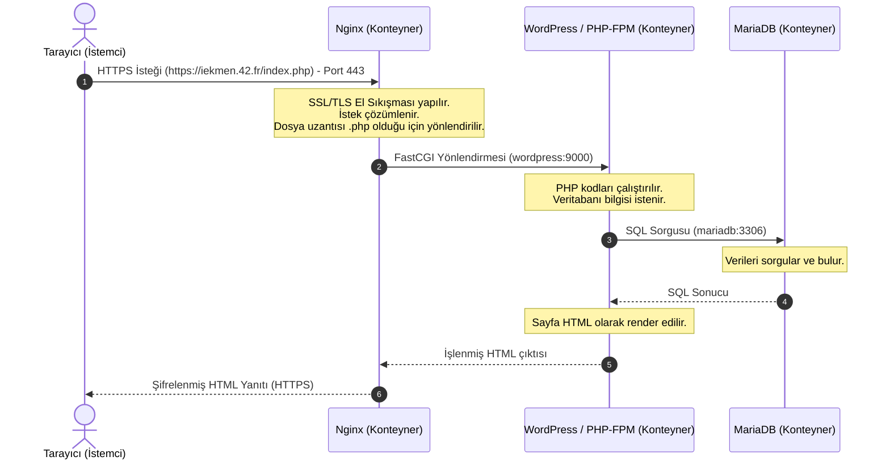

# Inception Projesi Detaylı Analiz ve Yapılandırma Rehberi

Bu doküman, 42 Network müfredatının sistem yönetimi ve sanallaştırma temellerini konu alan **Inception** projesinin tüm mimarisini, kullanılan teknolojileri ve bu teknolojilerin çalışma prensiplerini en temel seviyeden başlayarak tüm ayrıntılarıyla açıklamaktadır.

---

## 💻 1. Giriş: Inception Projesi Nedir?

**Inception**, Docker kullanarak sistem yönetimi ve mikroservis mimarisi tasarımı yapmayı öğreten bir projedir. Projenin temel amacı; hazır/resmi Docker imajları (hazır WordPress veya hazır Nginx imajları gibi) kullanmadan, **Alpine** veya **Debian** (bu projede `debian:bullseye` tercih edilmiştir) gibi ham bir işletim sistemi imajı üzerine servisleri sıfırdan kurup yapılandırmaktır.

Proje kapsamında şu üç temel servis Docker konteynerleri olarak ayağa kaldırılır:
1. **Nginx:** TLSv1.2 veya TLSv1.3 destekleyen güvenli bir Web Sunucusu (Web Server).
2. **WordPress (PHP-FPM ile):** İçerik Yönetim Sistemi ve uygulama sunucusu.
3. **MariaDB:** WordPress verilerini saklayan ilişkisel veritabanı.

Bu servisler, dış dünyaya yalnızca Nginx üzerinden (port 443 - HTTPS) açık olacak şekilde, birbirleriyle özel bir Docker ağı (`inception_network`) üzerinden haberleşirler.

---

## 🛠️ 2. Temel Teknolojik Kavramlar (En Temele İniş)

Projenin mantığını tam olarak kavramak için kullanılan teknolojilerin en temel çalışma prensiplerini bilmek gerekir.

### A. Docker ve Konteyner (Container) Nedir?
Geleneksel sunucu mimarisinde uygulamalar doğrudan fiziksel makinede veya **Sanal Makineler (Virtual Machine - VM)** üzerinde çalıştırılırdı. 

* **Sanal Makine (VM):** Bir Hypervisor katmanı üzerinde çalışır. Her VM'in kendine ait tam bir konuk işletim sistemi (Guest OS), sanal donanım sürücüleri ve çekirdeği (Kernel) vardır. Bu durum yüksek kaynak (CPU, RAM, disk) tüketimine ve yavaş açılma sürelerine neden olur.
* **Docker Konteynerleri:** Ev sahibi işletim sisteminin (Host OS) çekirdeğini (Kernel) ortaklaşa kullanır. Süreçleri (Process) mantıksal olarak birbirinden izole etmek için Linux çekirdeğinin **Namespaces** (ağ, süreç ID'leri, dosya sistemi izolasyonu için) ve **Cgroups** (CPU, RAM limiti belirleme için) özelliklerini kullanır. Konteynerler son derece hafiftir, saniyeler içinde başlar ve çok az kaynak tüketir.

### B. Docker Compose Nedir?
Tek bir konteyneri çalıştırmak için uzun `docker run ...` komutları kullanılabilir. Ancak birden fazla konteynerden oluşan karmaşık uygulamalarda, konteynerlerin birbirleriyle ilişkilerini, ağlarını, birimlerini (volumes) ve ortam değişkenlerini yönetmek zorlaşır. 

**Docker Compose**, çoklu konteyner içeren Docker uygulamalarını tanımlamak ve çalıştırmak için kullanılan bir araçtır. Tüm yapılandırma tek bir YAML dosyasında (`docker-compose.yml`) tanımlanır ve tek bir komutla (`docker compose up`) tüm sistem ayağa kaldırılabilir.

### C. Nginx Nedir ve Ne İşe Yarar?
**Nginx**, yüksek performanslı, olay güdümlü (event-driven) ve eşzamanlı istekleri çok düşük kaynak tüketimiyle işleyebilen açık kaynaklı bir **Web Sunucusu** ve **Tersine Vekil Sunucusudur (Reverse Proxy)**.

* **Web Sunucusu Olarak:** HTML, CSS, resim gibi statik dosyaları doğrudan tarayıcıya çok hızlı sunar.
* **Tersine Vekil (Reverse Proxy) Olarak:** İstemcilerden gelen istekleri karşılar ve arka plandaki diğer uygulama sunucularına (örneğin WordPress/PHP-FPM) yönlendirir.
* **SSL/TLS Şifreleme Sunucusu Olarak:** İstemci ile sunucu arasındaki trafiği şifreler. Inception projesinde Nginx, dış dünyayla konuşan tek servistir ve sadece port 443 (HTTPS) üzerinden şifreli bağlantıları kabul eder.

### D. MariaDB Nedir ve Ne İşe Yarar?
**MariaDB**, dünyanın en popüler ilişkisel veritabanlarından biri olan **MySQL**'in yaratıcıları tarafından geliştirilmiş, açık kaynaklı bir **İlişkisel Veritabanı Yönetim Sistemidir (RDBMS - Relational Database Management System)**.

* **Neden MariaDB?** Oracle firması MySQL'i satın aldıktan sonra topluluk, projenin tamamen açık kaynaklı kalmasını sağlamak amacıyla MariaDB'yi "fork" etti (çatalladı). Günümüzde MySQL ile neredeyse tamamen uyumludur ancak daha yüksek performanslı depolama motorları ve tamamen açık kaynaklı bir geliştirme modeli sunar.
* **İlişkisel Veritabanı Mantığı:** Verileri tablolarda (satır ve sütunlar halinde) tutar. Tablolar birbirleriyle "ilişkilendirilebilir" (örneğin, bir kullanıcının ID'si ile yazdığı blog yazısının yazar_ID'si eşleştirilir). WordPress; yazıları, kullanıcıları, yorumları ve site ayarlarını saklamak için bu veritabanına ihtiyaç duyar.

### E. WordPress Nedir ve Ne İşe Yarar?
**WordPress**, PHP ve MySQL/MariaDB tabanlı, dünya üzerindeki web sitelerinin %40'ından fazlasının altyapısını oluşturan açık kaynaklı bir **İçerik Yönetim Sistemidir (CMS - Content Management System)**.

* Kullanıcıların kod yazmadan web sitesi, blog veya e-ticaret siteleri oluşturmasını sağlar.
* Dinamik bir yapıya sahiptir. Tarayıcıdan bir istek geldiğinde, PHP kodları çalışır, MariaDB veritabanından gerekli bilgileri çeker, bunları HTML formatına dönüştürür ve Nginx üzerinden tarayıcıya gönderir.

### F. PHP-FPM Nedir? Neden Nginx Doğrudan PHP Çalıştıramaz?
Nginx statik dosyaları (HTML, resim vb.) okuyup göndermede harikadır ancak kendisi PHP kodunu yorumlayıp çalıştıramaz. PHP kodlarının çalıştırılabilmesi için bir PHP yorumlayıcısına ihtiyaç vardır.

* **PHP-FPM (FastCGI Process Manager):** PHP'nin web sitelerinde yoğun yük altındaki performansını artırmak için tasarlanmış bir FastCGI yöneticisidir. 
* **Çalışma Şekli:** Nginx, gelen bir `.php` isteğini aldığında bunu **FastCGI** protokolü aracılığıyla PHP-FPM'e (genellikle port 9000 üzerinden) paslar. PHP-FPM isteği işler, PHP kodunu derleyip çalıştırır, gerekirse veritabanı ile konuşur ve sonucu Nginx'e geri gönderir. Nginx de bu sonucu istemciye iletir.

### G. SSL/TLS ve Kendinden İmzalı (Self-Signed) Sertifika Nedir?
* **SSL/TLS (Secure Sockets Layer / Transport Layer Security):** İnternet üzerinde verilerin şifrelenmiş olarak iletilmesini sağlayan güvenlik protokolleridir. HTTPS (HTTP Secure), verilerin HTTP protokolü üzerinden TLS ile şifrelenerek gönderilmesidir.
* **Sertifika Yetkilisi (CA - Certificate Authority):** Güvenilir üçüncü taraf kuruluşlardır (Let's Encrypt, VeriSign vb.). Bir web sitesinin sertifikasını doğrularlar.
* **Kendinden İmzalı (Self-Signed) Sertifika:** Herhangi bir güvenilir otorite tarafından imzalanmamış, sunucu yöneticisinin kendi oluşturduğu sertifikadır. Trafiği tamamen şifreler (güvenlidir) ancak tarayıcılar bu sertifikayı doğrulayacak bir otorite bulamadığı için kullanıcıya "Bu site güvenli değil / Bağlantınız gizli değil" uyarısı gösterir. Inception projesinde lokalde çalıştığımız için `openssl` ile kendimiz self-signed sertifika üretiyoruz.

---

## 📐 3. Proje Mimarisi ve İstek Akışı (Request Flow)

Sistemde isteklerin nasıl işlendiğini anlamak için veri akışını takip edelim.

### İstek Akış Şeması (Mermaid)

### Güvenlik ve İzolasyon Kuralları
1. **Dışarıya Açık Portlar:** Sadece Nginx konteynerinin `443` portu dış dünyaya açıktır. MariaDB (`3306`) ve WordPress (`9000`) portları dışarıya kapatılmıştır.
2. **Konteynerler Arası Haberleşme:** Konteynerler sadece kendi aralarında, Docker tarafından oluşturulan `inception_network` adlı köprü (bridge) ağında konuşabilirler.
3. **Doğrudan Erişim Engeli:** MariaDB'ye dışarıdan kimse doğrudan erişemez. MariaDB sadece WordPress konteynerinden gelen sorguları kabul eder.

---

## 📂 4. Sistem Bileşenleri ve Yapılandırma Analizi

Projenin dosya yapısını ve her bir dosyanın ne işe yaradığını detaylıca inceleyelim.

### A. Docker Compose Yapılandırması (`srcs/docker-compose.yml`)

Bu dosya tüm sistemin orkestrasyonunu (yönetimini) sağlar.

* **Servisler (Services):**
  * `mariadb`, `wordpress` ve `nginx` servisleri tanımlanmıştır. Her birinin `build` parametresi ilgili Dockerfile'ın yolunu gösterir.
  * `restart: always` sayesinde çöken veya duran bir konteyner Docker tarafından otomatik olarak yeniden başlatılır.
  * `env_file: .env` ile `.env` dosyasındaki gizli şifreler ve değişkenler konteynerlerin içerisine aktarılır.
* **Ağlar (Networks):**
  * `inception_network` adında `bridge` tipinde özel bir sanal ağ tanımlanmıştır. Docker, bu ağa bağlı konteynerlerin birbirlerine isimleri ile ulaşabilmelerini sağlayan dahili bir DNS sunar (Örn: `wordpress` konteyneri `mariadb:3306` adresine erişebilir).
* **Kalıcı Depolama (Volumes):**
  * Konteynerler doğası gereği geçicidir (ephemeral). Konteyner silindiğinde içindeki tüm veriler kaybolur. Veritabanının ve yüklenen WordPress dosyalarının kalıcı olması için **Volumes** kullanılır.
  * Projede `wordpress_data` ve `db_data` isimli iki adet local bind mount tanımlanmıştır. Bu birimler host makinesindeki `/home/iekmen/data/wordpress` ve `/home/iekmen/data/mariadb` dizinlerine doğrudan bağlanmıştır (bind). Konteyner silinse bile veriler host makinede güvenle kalır.

---

### B. Nginx Servisi (`srcs/requirements/nginx/`)

Nginx, istemciden gelen HTTPS isteklerini karşılayan kapıdır.

#### 1. Dockerfile (`srcs/requirements/nginx/Dockerfile`)
* **`FROM debian:bullseye`:** Proje gereği Debian Bullseye tabanlı stabil bir sürüm kullanılır.
* **`RUN apt-get update && apt-get install -y nginx openssl`:** Nginx web sunucusu ve şifreleme anahtarları üretmek için OpenSSL aracı kurulur.
* **`RUN openssl req -x509 ...`:** 
  Bu komut kendinden imzalı (self-signed) bir SSL sertifikası (`inception.crt`) ve özel anahtarı (`inception.key`) üretir. Sertifikanın geçerlilik süresi, ülkesi (TR), şehri (Kocaeli) ve en önemlisi ortak adı (Common Name - CN) olan `iekmen.42.fr` bu komutla gömülür.
* **`COPY conf/nginx.conf /etc/nginx/nginx.conf`:** Konfigürasyon dosyamızı konteynerin içine kopyalar.
* **`EXPOSE 443`:** Nginx'in 443 portundan yayın yapacağını bildirir.
* **`CMD [ "nginx", "-g", "daemon off;" ]`:** 
  Nginx normalde arka planda (background daemon) çalışmaya meyillidir. Ancak Docker konteynerlerinde **PID 1** olarak çalışan ana sürecin (process) sonlanmaması gerekir. Eğer Nginx arka plana geçerse Docker konteynerin işinin bittiğini düşünerek konteyneri anında kapatır. `daemon off;` parametresi Nginx'i ön planda (foreground) çalışmaya zorlar ve konteynerin açık kalmasını sağlar.

#### 2. Konfigürasyon (`srcs/requirements/nginx/conf/nginx.conf`)
* **`listen 443 ssl;`:** Sadece güvenli 443 portunu dinler. SSL zorunludur.
* **`ssl_protocols TLSv1.2 TLSv1.3;`:** Güvensiz olan eski SSL/TLS sürümlerini (SSLv3, TLSv1.0, TLSv1.1) devre dışı bırakır. Sadece modern ve güvenli TLS 1.2 ve TLS 1.3 protokollerine izin verir.
* **`root /var/www/wordpress;`** ve **`index index.php;`:** Sitenin kök dizinini ve varsayılan olarak aranacak başlangıç dosyasını belirler.
* **`location ~ \.php$ { ... }`:** 
  Düzenli ifade (regex) kullanarak sonu `.php` ile biten tüm istekleri yakalar. Bu istekleri `fastcgi_pass wordpress:9000;` satırı ile `wordpress` konteynerinin `9000` portuna yönlendirir.

---

### C. MariaDB Servisi (`srcs/requirements/mariadb/`)

MariaDB, WordPress'in tüm verilerini güvenli bir şekilde saklar.

#### 1. Dockerfile (`srcs/requirements/mariadb/Dockerfile`)
* Debian tabanlı imaja `mariadb-server` kurar.
* Konfigürasyon ve başlatma betiklerini kopyalar.
* **`EXPOSE 3306`:** Veritabanının standart portunu dışarıya (sadece iç ağa) sunar.
* **`ENTRYPOINT [ "mariadb_init.sh" ]`:** Konteyner başladığında ilk olarak veritabanı kurulum scriptini çalıştırır.

#### 2. Konfigürasyon (`srcs/requirements/mariadb/conf/50-server.cnf`)
* **`bind-address = 0.0.0.0`:** Varsayılan olarak MariaDB sadece `localhost` (127.0.0.1) üzerindeki bağlantıları dinler. Ancak mikroservis mimarisinde WordPress konteynerinden gelen bağlantıları kabul etmesi için ağdaki tüm adresleri (`0.0.0.0`) dinlemesi gerekir.

#### 3. Başlatma Scripti (`srcs/requirements/mariadb/tools/mariadb_init.sh`)
Veritabanı ilk kez çalıştırıldığında yapılandırılmalıdır.
1. `service mariadb start` ile MariaDB servisini geçici olarak arka planda başlatır.
2. `mysql -e` komutları ile:
   * Ortam değişkenlerinden gelen `MYSQL_DATABASE` adında bir veritabanı oluşturur.
   * `MYSQL_USER` adında bir kullanıcı oluşturur ve bu kullanıcıya şifresini (`MYSQL_PASSWORD`) atar.
   * Bu kullanıcıya veritabanı üzerinde tam yetki (`GRANT ALL PRIVILEGES`) verir.
   * Veritabanı yöneticisi olan `root` kullanıcısının şifresini `MYSQL_ROOT_PASSWORD` ile günceller.
   * Değişiklikleri uygulamak için yetkileri yeniler (`FLUSH PRIVILEGES`).
3. `mysqladmin -u root -p$MYSQL_ROOT_PASSWORD shutdown` komutu ile geçici olarak başlattığı MariaDB servisini güvenli bir şekilde durdurur.
4. **`exec mysqld_safe`:** MariaDB'yi PID 1 olacak şekilde ön planda (foreground) çalıştırır. `exec` komutu, çalışan kabuk (shell) sürecinin yerini doğrudan `mysqld_safe` sürecinin almasını sağlar.

---

### D. WordPress Servisi (`srcs/requirements/wordpress/`)

WordPress, sitenin mantıksal işlerini yürütür ve PHP kodlarını yorumlar.

#### 1. Dockerfile (`srcs/requirements/wordpress/Dockerfile`)
* **`php7.4-fpm` ve `php7.4-mysql`:** PHP kodlarını çalıştırmak ve MariaDB veritabanı ile konuşabilmek için gerekli paketleri kurar.
* **`curl` ve `mariadb-client`:** WordPress dosyalarını indirmek ve veritabanı bağlantı testleri yapmak için araçlar yükler.
* **`wp-cli` Kurulumu:** WordPress kurulumunu, konfigürasyonunu ve kullanıcı oluşturma işlemlerini komut satırından otomatik yapabilmemizi sağlayan resmi komut satırı aracı (`wp`) kurulur ve `/usr/local/bin/` dizinine taşınır.
* **`EXPOSE 9000`:** Nginx ile konuşacağı PHP-FPM portunu açar.

#### 2. PHP-FPM Konfigürasyonu (`srcs/requirements/wordpress/conf/www.conf`)
* **`listen = 9000`:** PHP-FPM'in varsayılan Unix soketi yerine, TCP/IP üzerinden Nginx'ten gelecek istekleri dinlemesi için port `9000` olarak ayarlanır.
* **`user = www-data` ve `group = www-data`:** PHP süreçlerinin Debian üzerindeki standart web kullanıcısı yetkileriyle çalışmasını sağlar. Bu güvenlik açısından önemlidir.
* **`pm = dynamic`:** PHP süreçlerinin (process) gelen yüke göre dinamik olarak oluşturulup yok edilmesini sağlar.

#### 3. Başlatma Scripti (`srcs/requirements/wordpress/tools/wp_init.sh`)
Konteyner ilk kez ayağa kalktığında WordPress'i otomatik kurar:
1. `wp-config.php` dosyasının var olup olmadığını kontrol eder. Yoksa WordPress sıfırdan kurulacaktır.
2. `wp core download`: WordPress kaynak dosyalarını indirir.
3. `wp config create`: Veritabanı adı, kullanıcısı, şifresi ve host adresini (`mariadb:3306`) belirterek `wp-config.php` dosyasını oluşturur.
4. `wp core install`:
   * Sitenin başlığını ve URL'sini (`iekmen.42.fr`) ayarlar.
   * Yönetici (`admin`) kullanıcısını oluşturur. (42 kuralları gereği yönetici adı içinde **admin** veya **administrator** kelimeleri geçemez).
5. `wp user create`: Yönetici haricinde içerik üretebilecek ikinci bir normal kullanıcı (yazar rolünde) oluşturur.
6. `chown -R www-data:www-data /var/www/wordpress`: Tüm WordPress dosyalarının sahipliğini Nginx ve PHP'nin okuyup yazabilmesi için `www-data` kullanıcısına verir.
7. **`exec php-fpm7.4 -F`:** PHP-FPM servisini ön planda (foreground) çalıştırarak konteynerin açık kalmasını sağlar.

---

## 🔒 5. Çevre Değişkenleri ve Güvenlik (`.env`)

Sistemde hiçbir şifre veya hassas bilgi kaynak kodların içerisine doğrudan yazılmamalıdır (Hardcoded). Bunun yerine veriler `srcs/.env` dosyasında tutulur.

* **Neden Önemli?** `.env` dosyası genellikle `.gitignore` dosyasına eklenerek Git depolarına gönderilmez (güvenlik için). docker-compose bu dosyayı okur ve değişkenleri çalışma anında konteynerlerin içerisine aktarır.
* **İçerik Yapısı:** Veritabanı adı (`MYSQL_DATABASE`), veritabanı kullanıcı adı/şifresi, veritabanı root şifresi, WordPress admin kullanıcı adı/şifresi ve normal yazar kullanıcı adı/şifresi burada tanımlanır.

---

## ⚙️ 6. Sistemi Yönetmek: Makefile Kuralları

Projenin kök dizininde bulunan `Makefile`, sistemi kolayca yönetmek için kısayol komutları sunar.

| Komut | Açıklama |
| :--- | :--- |
| **`make`** veya **`make all`** | Host üzerinde gerekli hacim klasörlerini (`/home/iekmen/data/...`) oluşturur ve docker-compose ile tüm konteynerleri arka planda (`-d`) derleyerek (`--build`) ayağa kaldırır. |
| **`make down`** | Çalışan tüm konteynerleri durdurur ve siler ancak veritabanı ve WordPress dosyalarına (volümlere) dokunmaz. |
| **`make clean`** | Konteynerleri durdurur; ilişkili imajları ve ağları temizler. |
| **`make fclean`** | `make clean` işlemini yapar. Ek olarak host bilgisayardaki tüm kalıcı verileri (`/home/iekmen/data/*`) siler ve kullanılmayan tüm Docker nesnelerini temizler (`docker system prune`). |
| **`make re`** | Her şeyi sıfırlayıp sistemi baştan temiz bir şekilde derleyip çalıştırır. |

---

## ⚠️ 7. 42 Inception Projesinde Dikkat Edilmesi Gereken Kritik Kurallar

Projenin değerlendirilmesi (evaluation) sırasında sınavı geçmenizi sağlayan en kritik teknik detaylar şunlardır:

1. **Hazır İmaj Yasağı:** Docker Hub'dan direkt `nginx:latest` veya `wordpress:php7.4` çekemezsiniz. Her servisin Dockerfile'ı ham bir işletim sisteminden (Debian/Alpine) başlamalıdır.
2. **PID 1 Kuralı:** Konteynerler sanal makine değildir. Sadece tek bir görevi yerine getirmek için tasarlanmışlardır. Konteyner içindeki 1 numaralı süreç (PID 1) sonlandığında konteyner durur. Bu yüzden scriptlerin sonu mutlaka `exec` ile ön planda çalışan servise bağlanmalıdır (Örn: `exec php-fpm7.4 -F` veya `exec mysqld_safe`).
3. **SSL/TLS Zorunluluğu:** Nginx yapılandırmasında SSL sertifikaları doğru tanımlanmalı ve sadece TLS v1.2/v1.3 kabul edilmelidir. HTTP (port 80) istekleri tamamen engellenmeli veya yönlendirilmelidir.
4. **WordPress Admin Kısıtlaması:** WordPress yönetici kullanıcı adı asla `admin`, `administrator` veya bunları içeren bir kelime olamaz. Değerlendirmede ilk bakılan yerlerden biridir.
5. **Kalıcı Hacimler (Volumes):** Docker Volumes mutlaka host makinesinde belirtilen klasörlere (`/home/iekmen/data/...`) bind edilmelidir. Konteynerler durdurulup silindiğinde bile yüklenen resimler veya veritabanı kayıtları kaybolmamalıdır.
